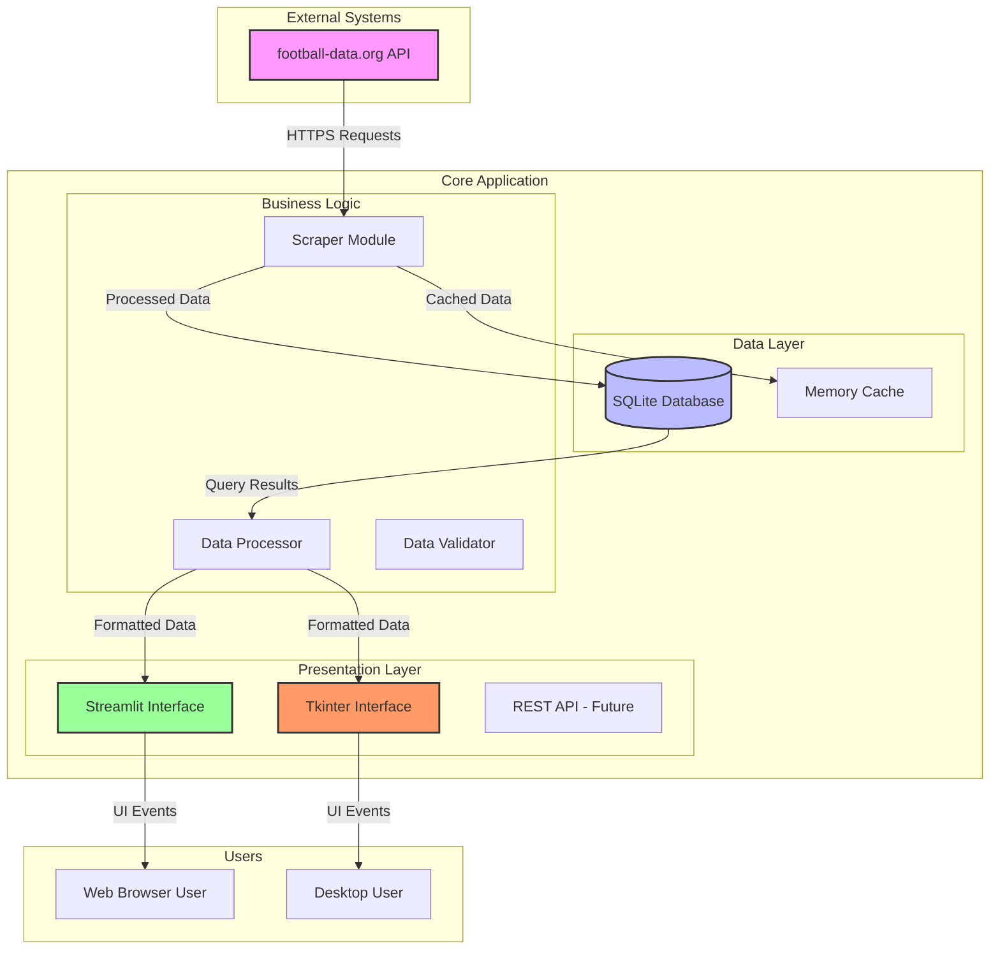

# ⚽ Football Data Scraper Pro

**A professional dual-interface application for collecting, analyzing, and visualizing football data in real-time.**  
**Supports multiple championships with automated scraping, SQLite storage, and interactive dashboards.**  
**Perfect for sports analysts, football fans, and data scientists needing structured football data.**

---

## 🛠 Technical Architecture

### 🏗️ System Architecture Overview



---

## ✨ Features

- **Dual Interface**: Web (Streamlit) + Desktop (Tkinter)
- **Multi-Championship Support**: Premier League, La Liga, Bundesliga, Serie A, Ligue 1
- **Real-time Data Collection**: Live matches, standings, team statistics
- **Local SQLite Database**: Efficient data storage and retrieval
- **Interactive Visualizations**: Plotly and Matplotlib charts
- **Data Export**: CSV, Excel, JSON formats
- **Smart Scraping**: Automatic rate limiting and error handling

---

## 🚀 Quick Start

### Installation
```bash
git clone https://github.com/omarbadrani/football-scraper-pro.git
cd football-scraper-pro
python -m venv venv
source venv/bin/activate  # Windows: venv\Scripts\activate
pip install -r requirements.txt
```

### Get API Key
1. Register at [football-data.org](https://www.football-data.org/)
2. Get your free API key
3. Add to `.env` file:
```env
FOOTBALL_DATA_API_KEY=your_api_key_here
```

### Run Applications
```bash
# Web Interface (Streamlit)
streamlit run football_app_streamlit.py

# Desktop Interface (Tkinter)
python football_app.py
```

---

## 📊 Functionalities

### Data Collection
- Real-time match data from multiple championships
- Team standings and statistics
- Historical data analysis
- Automated batch processing

### Analytics & Visualization
- Performance trend analysis
- Comparative team statistics
- Interactive dashboards
- Custom chart generation

### Data Management
- SQLite database with optimized queries
- Data validation and cleaning
- Export to multiple formats
- Backup and restore functionality

---

## 📁 Project Structure
```
football-scraper-pro/
├── config.py              # Configuration management
├── database.py           # SQLite database operations
├── scraper.py            # Football-data.org API integration
├── football_app.py       # Tkinter desktop application
├── football_app_streamlit.py  # Streamlit web application
├── requirements.txt      # Python dependencies
└── .env                  # Environment variables
```

---

## 🛠 Technology Stack

- **Backend**: Python 3.8+
- **Database**: SQLite
- **Web Framework**: Streamlit
- **Desktop GUI**: Tkinter
- **Data Processing**: Pandas, NumPy
- **Visualization**: Plotly, Matplotlib
- **API Client**: Requests
- **Configuration**: python-dotenv

---

## 📞 Contact

**Omar Badrani**  
📧 omarbadrani770@gmail.com  
📱 +216 92117418  
💼 [LinkedIn](https://www.linkedin.com/in/omar-badrani/)

---

## 📄 License

This project is licensed under the MIT License - see the [LICENSE](LICENSE) file for details.

---

**⭐ If you find this project useful, please give it a star on GitHub!**
